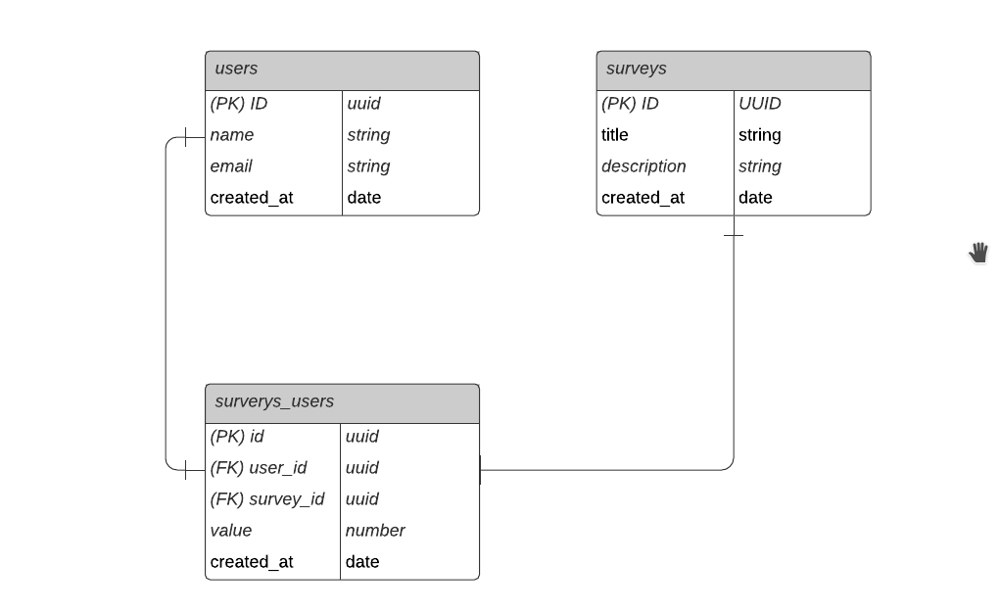

<h1 align="center">NPS-NLW</h1>

  <a href="#-tecnologias">Tecnologias</a>&nbsp;&nbsp;&nbsp;|&nbsp;&nbsp;&nbsp;
  <a href="#-projeto">Projeto</a>&nbsp;&nbsp;&nbsp;|&nbsp;&nbsp;&nbsp;
  <a href="#-diagrama">Diagrama</a>&nbsp;&nbsp;&nbsp;|&nbsp;&nbsp;&nbsp;
  <a href="#-como-executar">Como executar</a>&nbsp;&nbsp;&nbsp;|&nbsp;&nbsp;&nbsp;
  <a href="#-licença">Licença</a>

  
  
  
  
  
  

 

  

## ✨ Tecnologias

Esse projeto foi desenvolvido com as seguintes tecnologias:

- [TypeScript](https://www.typescriptlang.org/)
- [Ethereal-Email](https://ethereal.email/)
- [TypeORM](https://typeorm.io/#/)
- [Express](https://expressjs.com/pt-br/)
- [Jest](https://jestjs.io/)
- [SQL Editor Beekeeper Studio](https://www.beekeeperstudio.io/)

---

## 💻 Projeto

O NPS-NLW é uma aplicação que consiste em calcular o NPS da empresa. Nele fazemos o cadastro de usuários, cadastro de pesquisas, envio de e-mail para os usuários responderem as pesquisas de satisfação e com isso podemos realizar o cálculo do NPS.

---

## 🔶 Diagrama

---

## 🚀 Como executar

- Clone o repositório `https://github.com/israel206/CalculoNPS.git`
- Instale as dependências com `yarn`
- Inicie o servidor com `yarn dev`

A aplicação pode ser acessada em [`localhost:3333`](http://localhost:3333).

---

## 📄 Licença

Esse projeto está sob a licença MIT. Veja o arquivo [LICENSE](LICENSE.md) para mais detalhes.

---

Made with 💜💚💙[by Israel Silva](https://israel206.github.io/) 👋 copyrighted Rocketseat

[ts]: https://www.typescriptlang.org
[vscode]: https://code.visualstudio.com/
[yarn]: https://yarnpkg.com/
[vceditconfig]: https://marketplace.visualstudio.com/items?itemName=EditorConfig.EditorConfig
[vceslint]: https://marketplace.visualstudio.com/items?itemName=dbaeumer.vscode-eslint
